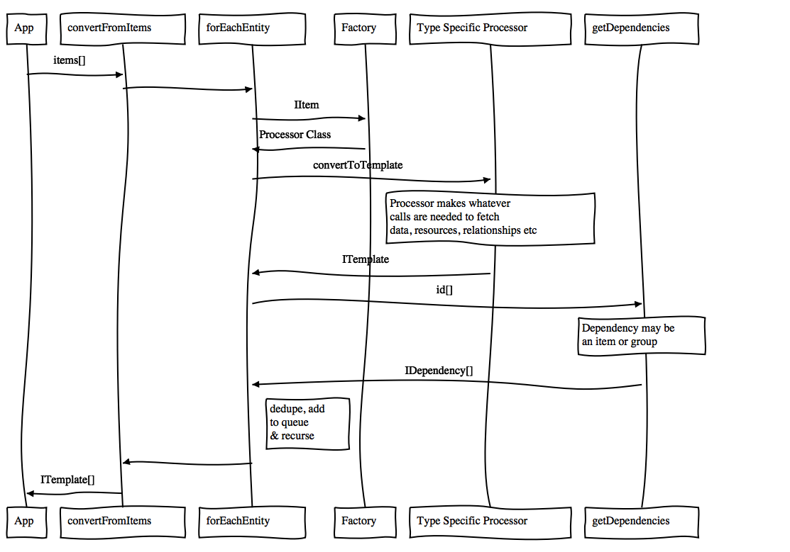

# Solution.js API

The three main processes make up the "core" of the Solution.js system:
- **Conversion**: transform an item/items/group to an array of templates
- **Persistence**: store an array of templates in a "Solution" item
- **Deployment**: create and connect a stack of new items, from an array of templates, optionally creating a Solution Item that has links to all the created items

# Conversion to Templates

Key changes to this area of the codebase:
- entire process should occur in-memory
- the conversion process should delegate as much as possible to the type specific processors. 
  - i.e. a type should know how to handle it's specific resources, info files etc etc, vs having some shared code try to handle all the possible cases
- core "orchestration" function should still report progress and handle clean-up on failures, without introducing side-effects
- support various logging levels to make debugging in production possible

The "Conversion" functions all return an array of `ITemplate` objects. This can then be directly used in the Deployment functions or persisted in a Solution item



## Convert Group Content to Templates

```js
export convertFromGroup(
    groupId:string,
    authentication: IAuthenticationManager
  ):Promise<ITemplate[]> {...}
```
Fetches the content of the group and delegates to `convertFromItems`. The group itself will not be included as a template.

This function should get all the `IItem`s shared to the group, and then pass that into `convertFromItems(...)`

## Convert Item to Templates

Three functions handle various scenarios depending on what the consuming app has already loaded.

```js
export convertFromItemId(
    itemId:string, 
    authentication: IAuthenticationManager
  ):Promise<ITemplate[]> {...}
```

Which delegates to...

```js
export convertFromItemIds(
    itemIds:string[], 
    authentication: IAuthenticationManager
  ):Promise<ITemplate[]> {...}
```

which fetches the items and delegates to...

```js
export convertFromItems(
    items: IItem[], 
    authentication: IAuthenticationManager
  ):Promise<ITemplate[]> {...}
```

This orchestrates the conversion, by delegating to type-specific processors, and returns and array of `ITemplate` objects.

*Note*: At this stage, the `resources` in the `IItemTemplates` will have a `url` property that points to the original location for item resources. 

*Note*: Some type specific processors may return Groups that are required for the item. This is why we use `ITemplate` not `IItemTemplate`, although most templates will be for items.


# Peristence to Solution Template Item
This is a new feature introduced into the system. Currently the Conversion process directly creates the Solution Template Item.

Decoupling this step allow for more flexibility in how the library is used, including a platform-wide "Clone Item" feature.

```js
export saveAsSolutionTemplate(
    solutionInfo: IItemAdd, 
    templates: ITemplate[]
  ):Promise<ISolutionModel> {...}
```

*Note*: This process must also copy each of the `IResourceInfo`s to a resources of the Solution item itself, updating the `IResourceInfo.url` property as it does so.

[IItemAdd](https://esri.github.io/arcgis-rest-js/api/types/IItemAdd/): Baseline information to create an item, in this case specific to creating the Solution item

# Deployment of a Solution
This is the process of converting from templates, back into fully operational items.

Key changes to this area of the codebase:
- actual deployment process should work from an in-memory object, and not require a Solution item
- all functions in the deployment process should return promises, and rely on the resolution/rejection of promises vs relying on side-effects
- the deployment process should delegate as much as possible to the type specific processors. 
- the core orchestration function should still report progress and handle clean-up on failures, without introducing side-effects
- support various logging levels to make debugging in production possible


## Deploy templates directly

Used in "cloning" workflows - allows for direct deployment of an in-memory array of templates. 

```js
export deployTemplates(
    templates: ITemplate[], 
    variables: object, // for template interpolation 
    authentication: IAuthenticationManager
  ):Promise<ITemplateOutput[]> {...}
```

**Note**: This does not create a Solution item with references to the deployed items.


## Deploy from Solution Template Item

Deploys the templates, based on a Solution Template item and returns a new Solution item that contains references to the deployed items.

```js
export deploySolution(
    itemId: string, 
    variables: object, // for template interpolation 
    authentication: IAuthenticationManager
  ):Promise<ISolutionModel> {...}
```


## Clone Item
Handles the entire "cloning" process. 

**Note**: This does not create a Solution item with references to the deployed items.

```js
export cloneFromItemId(
    itemId: string, 
    authentication: IAuthenticationManager
  ):Promise<ITemplateOutput[]> {...}
```

Which really delegates to:

```js
export cloneFromItem(
  item: IItem, 
  authentication: IAuthenticationManager
  ):Promise<ITemplateOutput[]> {...}
```

We don't anticipate a requirement to clone the entire contents of a group, although all the underlying functions would exist to implement that if the need arises.