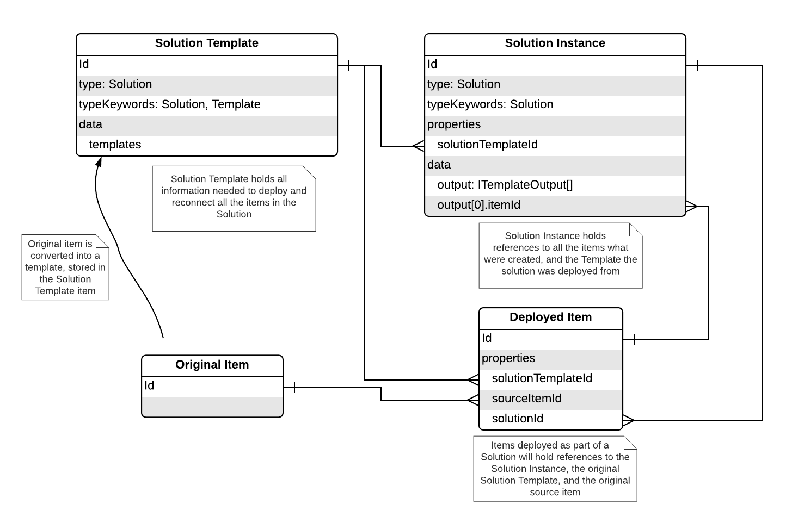

# Solution Lineage

Solution Lineage is the concept of being able to trace from instances of Solutions / Items back to their original source templates, and/or source items.

Goals:
- track a deployed item back to:
  - the Solution Instance it is related to (`solutionId`)
  - the Solution Template it was deployed from (`solutionTemplateId`)
  - the original item it was templated from (`sourceId`)

- track a Solution Instance back to
  - the Solution Template it was created from (`solutionTemplateId`)

Creating the lineage requires simply holding various id's in properties of the various items, as shown in the following diagram


[LucidCart Drawing](https://app.lucidchart.com/documents/edit/81a92f85-ae50-4f65-9e33-0ef9c9d8e6f1/0_0?beaconFlowId=392572DB9C8DD27B#?folder_id=home&browser=icon)


## Lineage Json
Stored in `item.properties` and thus not searchable, but we can traverse the ids. For simplicity of access, we should use these properties when programatically accessing the Ids (vs parsing typeKeywords)


```js
// Example for a Deployed Solution Instance
{
  ...
  properties: {
    solutionTemplateId: 'bc7', // Solution Template
  }
  ...
}
```

```js
// Example for a Deployed Item
{
  ...
  properties: {
    solutionId: '3ef', // Solution Instance
    solutionTemplateId: 'bc7', // Solution Template
    sourceItemId: '87c', // original item id
  }
  ...
}
```

### Searchable Lineage
These same properties are converted into `typeKeywords`, and used for searching:

```js
{
  ...
  typeKeywords: [
    "solutionid|3ef",
    "solutionTemplateId|bc7",
    "sourceItemId|87c"
  ],
  ...
}
```

