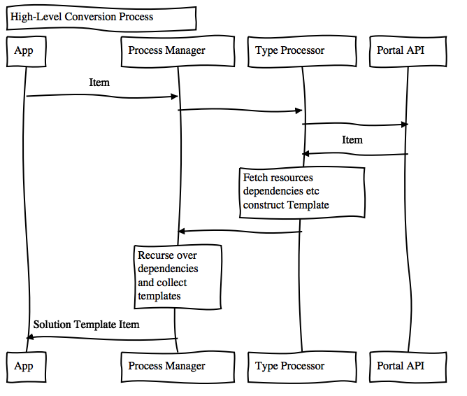
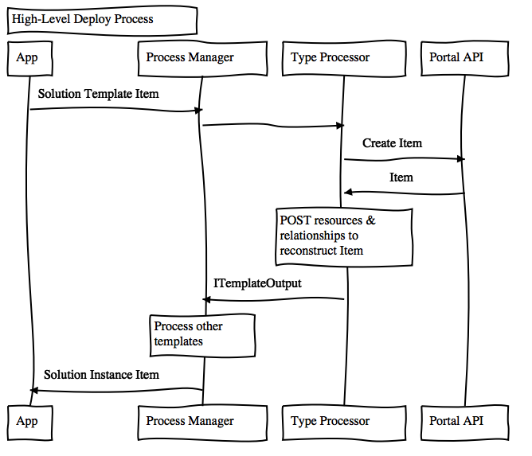

# Solution.js Road Ahead

The Solution.js project has been successful to date, but with that success have come opportunities to expand the project's capabilities, and make it easier to extend for use across all app teams within Esri.

If you are new to Solutions, take a moment to review the [terminology](./terminology.md) used.

## Core Features

### Convert Item to Template

The Core api orchestrates one or more type specific Processors, which communicate with the Portal API to construct a set of json templates, which collectively can be re-deployed to re-create the original item and its dependencies.

### Deploy Item from Template

The inverse of converting an item to a template. The Core api orchestrates type specific Processors which create new item instances, based on json templates.

## New Features

### Cloning Items with Dependencies
The current Solution system can take an item, determine all it's dependencies (other items, services, maps etc) and serialize that information into a set of Templates, which can then be used to re-deploy the entire "stack" of items, re-connecting all the dependencies. The system has all the necessary capabilities to enable "cloning" workflows, except it currently requires serializing the Templates to a Solution it prior to deployment.

### Simplified Item Type Specific Processors
To date, the Solutions team and the Hub team have collaborated on the creation of "type specific" processors - code which introspects items and determines their dependencies. This has been successful to date, but to be sustainable over time, we need the app teams who "own" specific item types to take over the creation and maintenance of these processors. To that end we need to make the processors much simpler to write, and maintain.

### Adding / Removing Individual Templates from a Solution
Currently, the items/groups that are converted to Templates are highly curated by the Solution Team, and it is a slow, iterative process to create Solution Templates that operate exactly as intended. To simplify the Solution Template editing experience, we need a means to re-convert a single item, and optionally it's dependencies, and have that injected into a Solution Item's Templates array, without disturbing other templates. We also need the option to add a new template into an existing solution, ensuring no duplication of dependencies. This can all be accomplished by refactoring the current system into a set of finer-grained templatizing function calls, along with some helper functions that can merge templates into a template array.

### Full Node.js Support
The original use case for Solution.js was focused on working in a browser. However, given the number of platform requests involved in the processing, it would be beneficial if we had the option to run the process in a server-side environment. The Hub team in particular is planning to build a http api to encapsulate the various process flows that will leverage Solution.js to ensure determistic outcomes regardless of the end-user's internet connection. To that end, the next major version of Solution.js must be able to run in Node.js

## Additional Documents
- [v2 Core API](./core-api.md)
- [v2 Processor API](./processor-api.md)
- [Processor Factory](./processor-factory.md)
- [Item Lineages](./lineage.md)
- [Workplan](./workplan.md)

## Other Considerations

In the process of implementing the features listed above, other necessary refactorings will also be undertaken. 

#### Improve Documentation and Naming
- function and variable names should express what something _is_ or what a function _does_ *in the context of the "process"*
- jsdoc comments that explain the "why" behind what is being done in a function
- guides should be created focusing on: 
    - maintainers of the Solution.js core
    - developers and maintainers of the Processors
    - developers who consume Solution.js

#### Focus on Functional-Style Programming
- functions should have a single `return`
- functions should have flat promise chains
- functions should have focused unit tests that only exercise logic _in the function_. Mock implementations should be used instead of allowing delegation into other functions. These tests should drive code-coverage reporting.
- separate "integration" tests should be created to ensure wholistic behavior is correct. These should not count towards code-coverage
- separate "end-to-end" tests should be created which run against actual items, in actual orgs, to ensure that everything actually works, and to track performance over time. Hub team has multiple orgs that exist specifically for this purpose, and can create users specifically for this testing.
- functions must not rely on side-effects. 
    - output of a function must depend entirely on arguments passed in.
    - callbacks may be used to indicate progress, but this should not be pushed deep down the stack. The outcome of a process should be returned to the caller via Promise resolution/rejection only.
- asynchronous functions (i.e. which make web requests), must return `Promises`.
- when calling asynchronous functions, caller must depend on the `Promise` resolution/rejection only.

#### Release Optimization
- Solution.js should be quick to release for any developer w/ correct access (npm + gh)
- decouple deployment of test harness apps from release of core library
- consider automation of release
    - i.e. merge to master from develop causes a release

#### General Clean up
- All messages returned from the library should use `ITranslatableMessage` to enable translation
- directly import rest-js functions vs using wrappers from `common`
- remove `@license` directive from all but top-level exports as it massively bloats webpack based builds using the library
- consistent use of `changelog`, perhaps using [commitizen](https://github.com/commitizen/cz-cli). Having a consistently mainatined changelog will become critical as project gets more developers and more consumers.

